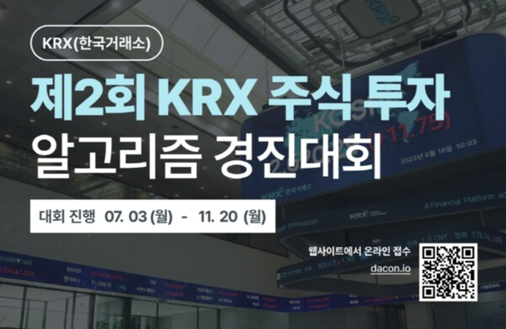

# 2nd KRX Algorithmic Stock Trading Competition

## Organizer

- **Korea Exchange (KRX)**

## Participation

- **Individual Entry (Solo)**

## Period

- July 3, 2023 – November 14, 2023

## Result

- **Encouragement Award Winner**
- **Certificate of Commendation from the Chairman of KRX**
- **Prize: KRW 3,000,000**

---

## Competition Details

### **Preliminary Round**

- **Objective**: Construct a portfolio of **50 long** and **50 short** domestic stocks, and evaluate model performance over a one-month return period.
- **Approach**:
  1. **Chart Pattern Similarity-Based Strategy**:
     - Searched for past time points that exhibited **patterns similar to the current state**.
     - Selected stocks showing patterns similar to those with **significant upward or downward movements** in the past, and used them for trading strategy.
  2. **Result**:
     - Successfully **advanced to the final round** using the pattern similarity-based strategy.

[Preliminary Round Code (Shared on Dacon)](https://dacon.io/competitions/official/236117/codeshare/8516?page=1&dtype=recent)

---

### **Final Round**

- **Objective**: Develop a stock trading library based on algorithmic strategies and evaluate return performance.
- **Requirements**:
  - Trading fee applied.
  - Daily trading allowed.
- **IDEAS**:
  1. **Optimizing Trading Frequency**:
     - Minimized frequent trading to **reduce transaction costs**.
     - Incorporated **fundamental indicators** to guide decisions.
  2. **Long-Term Investment Strategy**:
     - Designed **time-dependent investment logic** using initial capital to maximize holding period.
  3. **Model Based on Fundamental Indicators**:
     - Built a model using key indicators to estimate both **direction** and **velocity** with **time-dependent coefficients**.
     - **Stop-loss and take-profit rules**:
       - Defined based on two main financial indicators.

---

## Key Achievements

### **Technical Contributions**

1. **Development of Python-Based Algorithmic Trading Library**:

   - Designed a modular and reusable codebase that supports various strategies.
   - Major features:
     - Historical data analysis and pattern similarity detection.
     - Trade signal generation using fundamental metrics.
     - Automated logic for managing investment period and capital allocation.

2. **Systematized Trading Logic**:

   - Developed a unique strategy combining **chart similarity** and **fundamental analysis**.
   - Quantified **direction** and **velocity** to build time-sensitive trading logic.
   - Implemented clear stop-loss and take-profit criteria to manage risk.

3. **Clean Code Implementation**:
   - Focused on readability and maintainability.
   - Received strong feedback during code review for **structured design and well-named variables/functions**.
   - Thorough documentation and commenting enabled standalone use without team support.

### **Evaluation Result**

- Awarded **Encouragement Prize** for the **efficiency and robustness** of the investment strategy.
- Earned positive feedback for the **accuracy and completeness** of the algorithm design and implementation.
