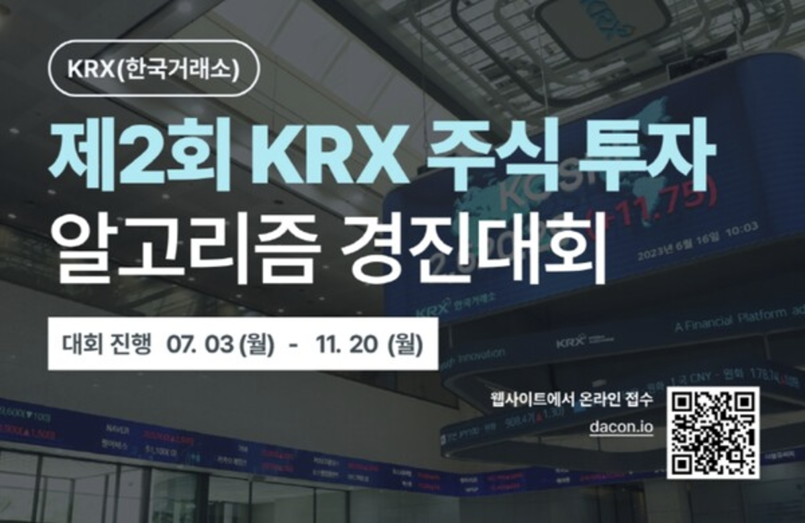

# 제 2회 한국거래소 알고리즘 주식투자 대회

[English Version](README_en.md)

## 주관
- **한국거래소**

## 참여
- **개인 참가 (1인)**

## 기간
- 2023.07.03-2023.11.14

## 결과
- **장려상 수상**
- **한국거래소 이사장 표창장 수여**
- **상금: 300만원**

---

## 대회 진행 내용

### **예선**
- **목표**: 국내 상장 종목 중 **50개 long** / **50개 short** 포트폴리오 구축 및 한 달간 모델 수익률 평가.
- **접근 방법**:
  1. **차트 유사성 기반 투자 전략**:
      - 과거 데이터에서 현재 시점과 **유사한 패턴**을 가진 시점을 탐색.
      - 해당 시점에서 **큰 상승** 또는 **큰 하락**을 기록한 종목과 유사한 패턴을 보이는 종목을 선택하여 매매 전략 수립.
  2. **결과**:
      - 유사성 기반의 전략으로 **본선 진출** 성공.

[예선코드-코드공유](https://dacon.io/competitions/official/236117/codeshare/8516?page=1&dtype=recent)

---

### **본선**
- **목표**: 알고리즘 기반 주식투자 라이브러리 개발 및 거래 수익률 평가.
- **조건**:
  - 매매 수수료 도입.
  - 매일 거래 가능.
- **IDEA**:
  1. **매매 빈도 최적화**:
      - 매매 수수료를 고려하여 **잦은 거래를 지양**.
      - 일정 수준의 **Fundamental 지표** 활용.
  2. **장기 투자 지향**:
      - 투자 기간을 최대화하기 위해 초기 투자금을 활용한 **시간 의존적 투자 전략** 수립.
  3. **Fundamental 지표 기반 모델 구축**:
      - 주요 지표들을 기반으로 **방향(direction)**과 **속도(velocity)**를 **시간 의존적 계수(time-dependent coefficient)**로 활용하여 최종 투자 모델 개발.
      - **손절매 및 익절매 기준**:
          - 두 가지 주요 지표를 기반으로 설정.

---

## 주요 성과

### **기술적 기여**
1. **Python 기반 알고리즘 주식투자 라이브러리 구축**:
   - 다양한 투자 전략을 손쉽게 구현할 수 있는 구조화된 코드 작성.
   - 모듈화된 설계로 코드 재사용성과 확장성을 극대화.
   - 주요 기능:
     - 과거 데이터 분석 및 유사성 탐지 알고리즘.
     - Fundamental 지표를 활용한 매매 신호 생성.
     - 투자 기간 및 자본 관리 최적화를 위한 자동화 로직.

2. **매매 논리의 체계화**:
   - Fundamental 지표와 차트 유사성을 결합한 독창적 투자 모델 개발.
   - **방향성(Direction)**과 **속도(Velocity)**를 수치화하여 시간 의존적인 매매 논리를 강화.
   - 손절매 및 익절매 기준을 명확히 설정하여 리스크 최소화.

3. **클린 코드 구현**:
   - 가독성과 유지보수성을 고려한 클린 코드 작성.
   - 코드 리뷰 과정에서 **구조적 설계와 명확한 변수/함수 정의**로 높은 평가를 받음.
   - 주석과 문서화 작업을 철저히 수행하여 팀원 없이도 코드 활용 가능.

### **평가 결과**
- 투자 전략의 **효율성과 안정성**을 인정받아 **장려상** 수상.
- 알고리즘 설계와 라이브러리 구축에서 보여준 **정확성과 완성도**로 심사위원들에게 긍정적 평가 획득.

    